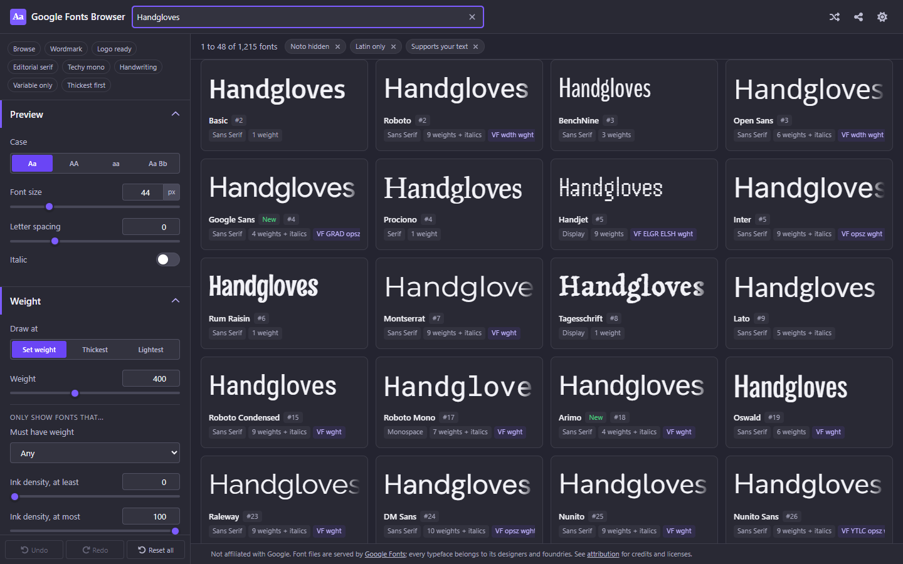

# Google Fonts Browser

Type your brand name once and see it drawn by every Google Font on one page. All 1,942 families, filtered by measured ink density rather than the weight number a font declares about itself, with the embed code for whichever one you pick sitting one click away.

**[Live demo](https://googlefonts.adamculpepper.net/)**



## What it does

Picking a typeface for a logo usually means opening fonts.google.com, typing your text into one preview box, going back, typing it into the next one. This app does that part in bulk. You type once and the whole catalog renders your text, in a grid you can sort, filter, and page through.

It opens on 48 fonts a page. Change that to 96, to 192, or to "Show all", which puts all 1,942 families on one endless page that stays smooth because only the rows near your scroll position exist in the DOM.

Three filters are on by default: Noto families are hidden, non-Latin families are hidden, and fonts missing a character you typed are hidden. Each one shows as a removable chip above the grid, so nothing is quietly missing from your results.

Your text goes two places: to Google's font API, which needs the characters to cut a matching subset, and into the share URL in your address bar so a link can reproduce the view. Nothing else reads it; the site's analytics is configured to drop the URL hash for exactly this reason. Favorites and lists live in your browser's local storage.

## Features

- **Measured ink density.** Every family was rasterized at build time and scored 0 to 100 on how much ink it actually puts on the page. Anton at weight 400 is blacker than Roboto at 900, which the declared numbers will never tell you. Sort by "Thickest ink first" or set a min and max on the density sliders.
- **Weight controls, split in two.** One half decides how fonts are drawn: at one weight for everything (families without that exact weight snap to their nearest and the card says which), or each family at its own thickest or lightest. The other half decides which fonts are shown, with a "must have 700 or bolder" filter that can count a variable font's weight range instead of only its named styles.
- **Filters that answer real questions.** Category, variable fonts only, has italic, hide Noto, Latin script only, and "must support my text", checked against each font's real character coverage rather than a guess from its language tags.
- **Favorites and named lists.** Star anything, or file it into a list you name. Saved in this browser and nowhere else, which is also why lists never ride a share link.
- **Compare tray.** Pin up to 8 families into a strip along the bottom, then open the side-by-side view. One button copies a single embed covering everything pinned.
- **A detail panel per font.** Full weight ladder with an italic toggle, live sliders for every variable axis, a size waterfall, the character set, and four copy-ready embeds: link tag, `@import`, Fontsource npm, plain CSS.
- **Share links that carry the view.** The whole configuration packs into the URL hash, including the pinned set, the open font, and the shuffle seed, so a random order somebody liked reproduces from their link.
- **8 presets.** Wordmark, Logo ready, Editorial serif, Techy mono, Handwriting, Variable only, Thickest first, and Browse to get back to the start. A preset merges over your current settings as one undo step.
- **Dark and light themes**, seeded from your OS setting and remembered after that.

## Getting started

```bash
npm install
npm run dev        # start the Vite dev server
npm run build      # production build into dist/
npm run preview    # serve the production build
```

Open the printed local URL (usually http://localhost:5173).

The catalog at `public/data/fonts.json` is committed, so a fresh clone runs without touching the network. Rebuild it only when you want newer families:

```bash
npm run data:refresh   # about 45 seconds cold, one HTTP request when nothing changed
```

## Keyboard shortcuts

| Key | Action |
| --- | --- |
| `T` | Focus the preview text |
| `/` | Focus the name search |
| `J` / `K` | Move between fonts |
| `Enter` | Open the focused font |
| `P` | Pin the focused font to compare |
| `F` | Add the focused font to favorites |
| `C` | Copy CSS for the focused font |
| `Esc` | Close panels and dialogs |
| `?` | Show the shortcuts sheet |

Letter shortcuts stay quiet while you are typing in a field, so `f` in the search box types an `f`.

## How it works

### Fonts arrive one word at a time

A card does not need a whole typeface. It needs the letters in your text. Every request to Google's css2 endpoint carries `text=` with exactly the characters you typed, and the face that comes back holds only those glyphs. A few kilobytes instead of the roughly 25 KB a full Latin subset costs, times however many cards are on screen.

The charset is normalized to sorted unique codepoints before it goes into the URL, because Google normalizes it that way too. Two people typing the same word produce a byte-identical URL, and byte-identical URLs are HTTP cache hits.

Requests are chunked at 24 families, which is roughly two screens of cards. The first chunk paints while the rest is still in flight, and a chunk that fails costs 24 cards rather than the whole viewport. The endpoint's hard cap is 120 families per request; the app asks for at most 100 so a tightened limit could never take it down.

### Every face is registered under a name nobody types

Faces are fetched with `fetch()` and registered as `FontFace` objects, never by injecting a `<link>`. CSS-connected faces cannot be removed one at a time, and inserting a stylesheet forces a document-wide style recalc.

Each face gets a generation alias, `gf_<slug>_<charsetHash>`, instead of its real family name. When you retype, the new subset is a different font as far as the browser is concerned, so the swap is atomic per card and the old generation can be deleted the moment it is safe. Swap first, evict second: a family's previous generation only goes away once its replacement is ready, so a card never loses its font before gaining the next one.

One detail that looks like a bug and is not. Constructed faces deliberately omit `unicodeRange`. Copying the range from the response would let a missing character fall through to the next font in the stack, which hides a coverage gap behind a lookalike glyph. Omitting it renders the missing character as this font's own `.notdef` box, which is the honest answer for a specimen tool.

### The grid holds the whole catalog

One virtual item is one row of N uniform cards, and row height is a pure function of the settings: specimen box, meta line, padding. The virtualizer never measures the DOM, so `estimateSize` is exact and `getTotalSize` is a multiply. Typing into the preview box causes no layout thrash and no scroll jump.

That determinism is what makes "Show all" viable. 1,942 families on one page is about two screens of real DOM at any moment. Column count comes from the font size, so cranking the size to 160px thins the grid to one or two wide tracks on its own.

### Ink density is measured, not declared

Weight numbers are a family's opinion of itself. Anton ships one weight, calls it 400, and lands darker on the page than most fonts at 900. Sorting or filtering by the declared number gives you a list ordered by what foundries chose to name things.

So the build measures it. For each family it downloads the heaviest servable weight as a raw TTF, parses the outlines, and rasterizes `HAMBURGEFONTSIV` with a scanline nonzero-winding fill at 600 columns with 2x vertical supersampling. Ink is measured against the glyphs' own bounding box rather than the em box, so a font with generous side bearings is not punished for it. The ratio normalizes to an integer 0 to 100 against frozen anchors, which is what the density sliders and the two ink sorts read.

Families without a Latin subset get a 12-codepoint sample from their own script and are flagged non-comparable, since a Devanagari sample and a Latin one are not measuring the same thing. Four families in the current catalog cannot be measured at all and carry -1.

### "Must support my text" answers offline

Google's metadata gives per-family character ranges. Turning that into a fast per-keystroke check meant fixing a probe of 489 codepoints (printable ASCII, Latin-1 supplement, Latin Extended-A, common typographic marks, Greek, Cyrillic) and storing one bit per slot. That is 62 bytes per family, and only 634 distinct masks exist across 1,942 families, so the catalog stores a deduplicated palette and each family holds an index into it.

Checking whether a font can draw your text is then a bitmask lookup with no network call. Characters outside the probe are treated as passing rather than failing, because guessing wrong in that direction hides fonts that would have worked.

### The data pipeline has no dependencies

`scripts/build-data.mjs` is Node stdlib and nothing else. No font library, no HTTP client, no build tooling. It reads Google's metadata endpoint, diffs every family against a local cache on `lastModified` and `size`, and only works on what changed. A refresh with nothing new costs exactly one HTTP request.

For each family that does need work it fetches the per-family coverage, walks the weight ladder heaviest first until css2 hands back a real font URL, downloads that file, and measures it. The TrueType parser (`src/lib/font/sfnt.js`) and the rasterizer (`src/lib/font/raster.js`) import nothing at all. The output is `public/data/fonts.json` at 262 KB raw, 56 KB gzipped, plus a generated `src/data/catalog-meta.js` carrying a build stamp the app uses as its cache buster.

A quirk worth knowing if you touch the pipeline: the `User-Agent: googlefonts-build` header is load-bearing. Google serves woff2 to browsers and raw TTF to everything else, and the rasterizer reads TTF.

## Project structure

```
src/
  lib/          fontUrl (css2 URLs, chunk planning, response parsing),
                fontLoader (the one stateful module: fetch + FontFace),
                fullFamilyLoader, fontLru, coverage, fontCoverage,
                familySelect (filter, sort, slice), searchIndex, weights,
                embedSnippets, collections, catalog, stateCodec,
                pinnedCodec, storage, textTransform
  lib/font/     sfnt (TrueType parser), raster (scanline fill), blackness
  data/         params (the control registry), presets, version,
                catalog-meta (generated, do not hand-edit)
  context/      AppContext (settings + history), CollectionsContext,
                FontManagerContext, CardActionsContext
  hooks/        useCatalog, useVisibleFamilies, useFontStatus, useFocusTrap,
                useDebouncedValue, useCopyFlag, useMediaQuery
  components/   Header, Sidebar, ControlSection, controls/, FontStage,
                FontGrid, FontCard, DetailPanel, CompareTray, CompareView,
                Pagination, ResultsBar, Presets, ListsDialog, ListPicker,
                ListFilterControl, ShortcutsSheet, Banner, Toast, Tooltip
  styles/       variables, themes, global CSS
scripts/        build-data.mjs, verify-data.mjs, verify-fonturl.mjs, lib/net.mjs
public/data/    fonts.json (the built catalog, committed)
```

`src/data/params.js` describes every control, and that one array feeds the sidebar, the defaults, the filter chips, and the share URL. Adding a knob is one entry plus whatever reads it in `lib/`.

Most of `src/lib/` is pure: no DOM, no network, no clock, no randomness. Four modules break that on purpose and say so in their headers: `fontLoader` and `fullFamilyLoader` own the network and `document.fonts`, `fontCoverage` owns a probe canvas, and `storage` (with `collections` on top of it) owns localStorage. The purity of the rest is not a style preference. It is what lets the Node verify scripts import the same modules the browser runs, so a passing check is a statement about production code rather than a test-only copy of it.

## Verify scripts

```bash
npm run data:verify      # 33 checks against the built catalog
npm run verify:fonturl   # 182 checks across the pure engine layer
```

`data:verify` runs as `prebuild`, so a broken catalog fails the build before Vite starts. It is fully offline. It checks the artifact's byte budget (400 KB raw, 120 KB gzipped), the row shape, the enum tables, weight and axis sanity, and coverage masks decoding to the right length. It also pins real anchors: Anton has to come out heavier than Roboto and Raleway, Alfa Slab One has to score above 80, and the coverage masks have to say that Anton draws A to Z while missing a Cyrillic letter that Noto Sans handles. A family-count floor of 1,900 catches a refresh that silently returned half a catalog.

`verify:fonturl` covers URL building, family specs, chunk planning, `@font-face` response parsing, the loaded-face LRU, the filter/sort/slice pipeline, and the search index. Its last section is a source-level audit: it reads those modules off disk and fails if any of them mentions `Math.random`, `Date.now`, `document`, `window`, `fetch(`, `localStorage`, or an import from outside its own folder. Purity is checked, not just intended.

Both print a pass line per check and exit non-zero on the first failure, so they work as a pre-push gate.

## Deploy

`.github/workflows/deploy.yml` builds on every push to `master` and publishes `dist/` to GitHub Pages. In the repo settings, Pages needs its source set to **GitHub Actions** for the first run to land. That is a one-time click and the workflow cannot do it for you.

`public/CNAME` carries the custom subdomain, `googlefonts.adamculpepper.net`, and Vite copies it into `dist/` on every build. Deleting it would drop the site back to the `github.io` URL.

Two things the build depends on:

- `vite.config.js` sets `base: './'`, so every asset reference stays relative and the same build works from a Pages subpath and from the custom subdomain.
- The workflow deletes `package-lock.json` before installing. A lockfile generated on Windows leaves out the Linux rollup optional dependencies (npm/cli#4828), and the Linux runner needs to resolve those fresh.

The build runs `npm run data:verify` first through the `prebuild` hook. No network call happens during CI: the catalog is committed and the verify script is offline.

## Tech stack

Vite 5 and React 18, no TypeScript, plain co-located CSS with custom properties. `@tanstack/react-virtual` for the grid. FontAwesome for icons, installed from npm rather than a CDN.

The data pipeline carries no dependencies at all. The TrueType parser, the scanline rasterizer, the coverage bitset codec, and the base64 encoder are written out against the Node 22 stdlib, and the same coverage module runs unchanged in the browser. Global `fetch` is the real floor, so Node 18 or newer will run it. CI stays on Node 20 and never runs the pipeline, only the offline verify.

## Attribution

This project is not affiliated with Google. It is an independent browser for a public catalog.

Font files are served by [Google Fonts](https://fonts.google.com), and every typeface belongs to its designers and foundries. Licenses differ from family to family, so this app never states one. Each font's detail panel links to its own page on Google Fonts, which is where the current license for that family lives.

Google's own attribution guidance is at [fonts.google.com/attribution](https://fonts.google.com/attribution).
